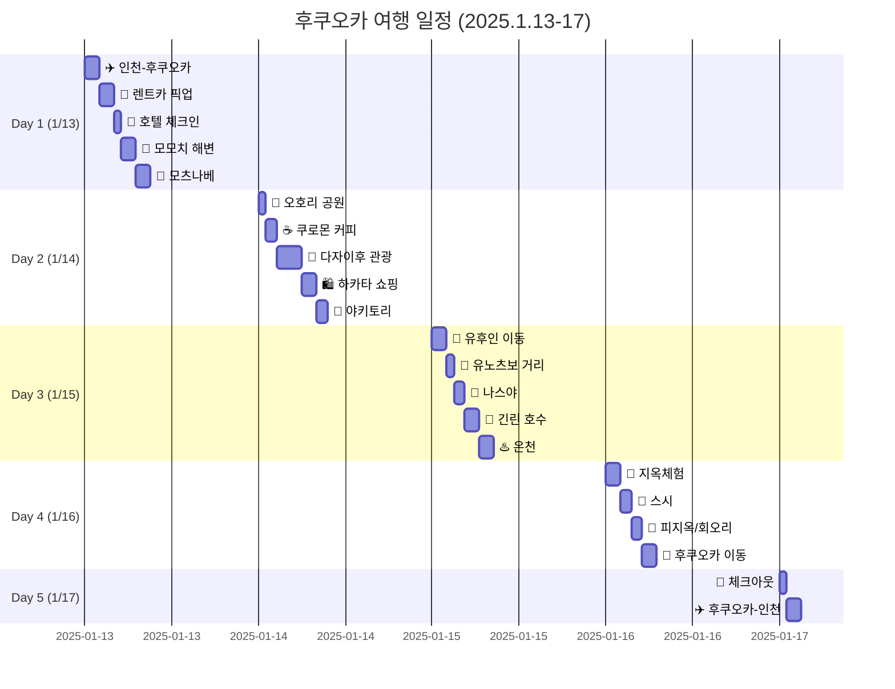
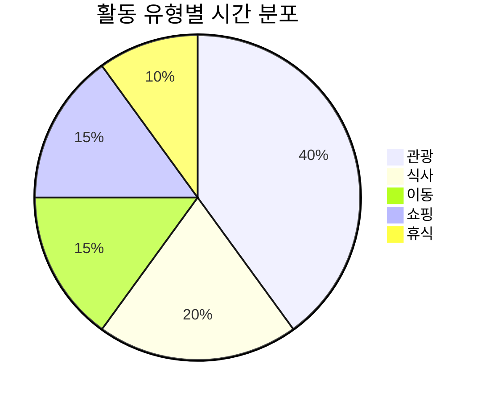

# 후쿠오카 여행 칸반보드

## 전체 일정 칸반

## 일정 상태 보드

| ✅ 완료 | ⏳ 예약 필요 | 🎯 후보 |
|:--|:--|:--|
| ✈️ 인천-후쿠오카 항공 | 🍜 나스야 | ☕ 쿠로몬 커피 |
| 🚗 렌트카 예약 | 🍣 스시 | 🍺 나카스 야타이 |
| 🌅 모모치 해변 | 🍖 야키토리 쿠로다 | ☕ 유후인 미르히 |
| 🌳 오호리 공원 | ☕ 스타벅스 다자이후점 | 🍜 에비스야 우동 |
| 🏯 다자이후 천만궁 | | 🍖 오코노미야키 아사야마 |
| 🏃 유노츠보 거리 | | |
| 🌅 긴린 호수 | | |
| 🌊 지옥체험 | | |

## 지역별 동선

## 시간대별 활동 분포

## 📝 범례
- ✈️ 항공 | 🚗 이동 | 🏨 숙박
- 🍜 식사 | 🌅 관광 | 🛍️ 쇼핑
- ☕ 카페 | ♨️ 온천 | 🏯 사찰
